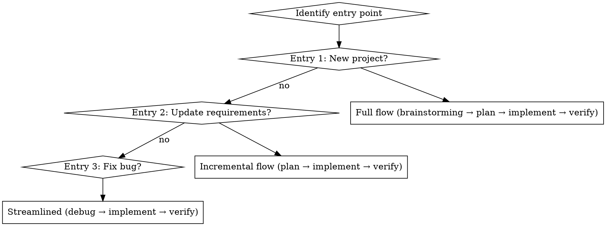
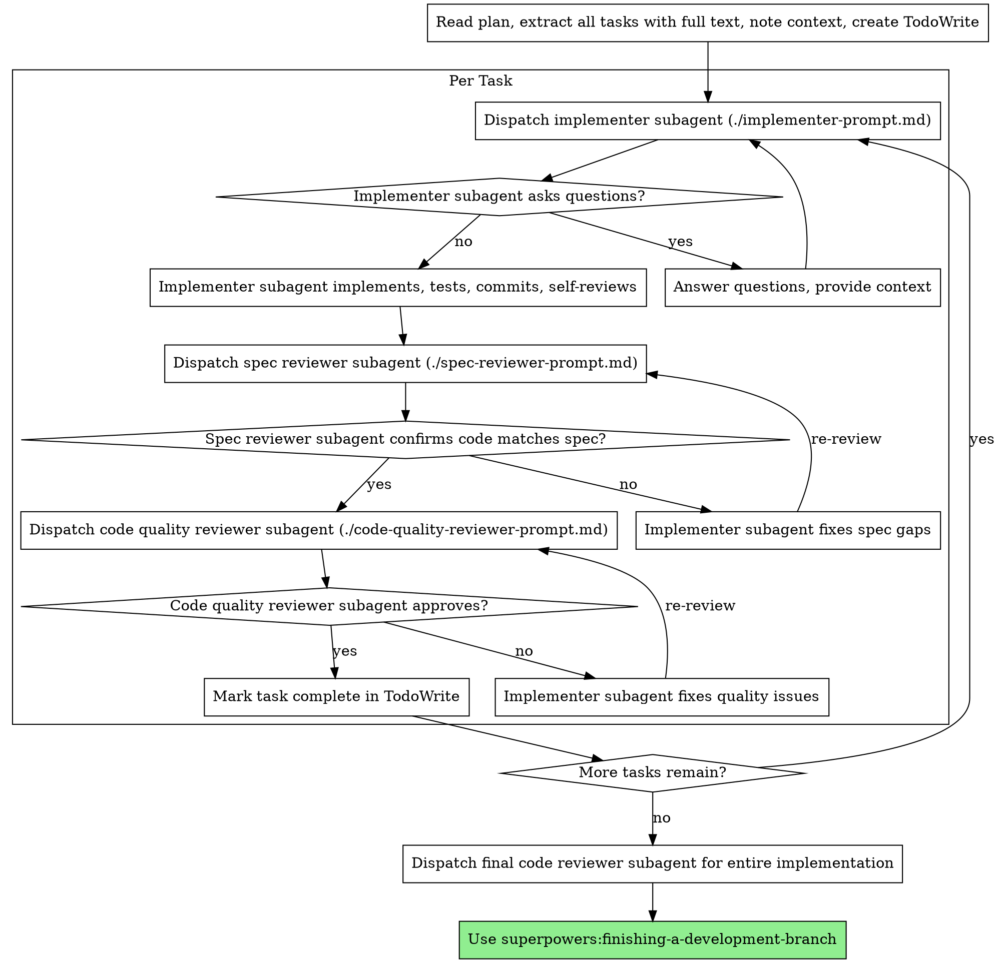

# Subagent-Driven Development

Execute plan by dispatching fresh subagent per task, with two-stage review after each: spec compliance review first, then code quality review.

**Why subagents:** You delegate tasks to specialized agents with isolated context. By precisely crafting their instructions and context, you ensure they stay focused and succeed at their task. They should never inherit your session's context or history — you construct exactly what they need. This also preserves your own context for coordination work.

**Core principle:** Fresh subagent per task + two-stage review (spec then quality) = high quality, fast iteration

## Three Entry Points

> Every task belongs to one of three entry points. Identify the entry point first, then follow the corresponding flow.

### Entry Point 1: Create New Project (Full Flow)

**Trigger:**
- "帮我做一个 XX 项目" / "开发一个新 XX"
- "创建一个 XX 系统"
- No existing project in workspace

**Flow:** Full 5-stage pipeline

```
Stage 1: Requirements → Stage 2: Design → Stage 3: Plan → Stage 4: Implementation → Stage 5: QA
```

**Steps:**
1. brainstorming → outputs design document
2. writing-plans → outputs implementation plan
3. **This skill (subagent-driven-development)** → Stage 4 execution
4. verification-before-completion → Stage 5 QA

---

### Entry Point 2: Update Requirements (Incremental Flow)

**Trigger:**
- "给 XX 项目增加 XX 功能" / "修改 XX 的需求"
- "更新 XX 项目"
- Project exists but requirements changed

**Flow:** Resume from Stage 2 or 3 (skip completed stages)

```
Determine starting stage from PROGRESS.md stage field
    ↓
Stage 2 or 3 → brainstorming / writing-plans (if needed)
    ↓
Stage 4: subagent-driven-development
    ↓
Stage 5: verification-before-completion
```

---

### Entry Point 3: Fix Bug (Streamlined Flow)

**Trigger:**
- "修 XX bug" / "修复 XX 问题"
- "XX 有问题"
- Project exists with a bug to fix

**Flow:** Skip Stages 1-3, go directly to 4→5

```
Stage 4: systematic-debugging → identify root cause → record in PROGRESS.md notes
    ↓
Stage 4: subagent-driven-development (with root cause in context)
    ↓
Stage 5: verification-before-completion
```

**Important:** After systematic-debugging, the root cause MUST be written to PROGRESS.md notes before dispatching the implementer subagent.

---

### PROGRESS.md Initialization Templates

**Entry Point 1 (New Project):**
```markdown
# {name}

stage: 1
project_dir: project/{name}/

stages:
  1_requirements: ○
  2_design: ○
  3_planning: ○
  4_development: ○
  5_qa: ○

active_task: Requirements - collecting user requirements

notes: |
  (awaiting user description)
```

**Entry Point 2 (Update Requirements):**
```markdown
# {name}

stage: 2
project_dir: project/{name}/

stages:
  1_requirements: ✅
  2_design: 🔄
  3_planning: ○
  4_development: ○
  5_qa: ○

active_task: Update requirements - redesign {feature name}

notes: |
  Requirement change: {description}
  Reason: {why the change is needed}
```

**Entry Point 3 (Bug Fix):**
```markdown
# {name}

stage: 4
project_dir: project/{name}/

stages:
  1_requirements: ✅
  2_design: ✅
  3_planning: ✅
  4_development: 🔄
  5_qa: ○

active_task: Bug fix - {bug description}

notes: |
  Root cause: {from systematic-debugging}
  Fix: {what was changed}
```

## When to Use



**vs. Executing Plans (parallel session):**
- Same session (no context switch)
- Fresh subagent per task (no context pollution)
- Two-stage review after each task: spec compliance first, then code quality
- Faster iteration (no human-in-loop between tasks)

## The Process



## Model Selection

Use the least powerful model that can handle each role to conserve cost and increase speed.

**Mechanical implementation tasks** (isolated functions, clear specs, 1-2 files): use a fast, cheap model. Most implementation tasks are mechanical when the plan is well-specified.

**Integration and judgment tasks** (multi-file coordination, pattern matching, debugging): use a standard model.

**Architecture, design, and review tasks**: use the most capable available model.

**Task complexity signals:**
- Touches 1-2 files with a complete spec → cheap model
- Touches multiple files with integration concerns → standard model
- Requires design judgment or broad codebase understanding → most capable model

## Handling Subagent Result Verification (IMPORTANT)

**Problem:** Subagent tool result delivery is unreliable — subagent may complete work (git commit) but result times out before delivery. This causes the controller to incorrectly assume work was not done.

**Solution: Use git log as the single source of truth.**

Subagent result delivery may fail, but **git commit never lies**. Always verify via git log, not via subagent report.

### The Verification Loop

```
Spawn subagent with task
    ↓
Wait up to [timeout] for result
    ↓
Result arrived? → ✅ Use it
    ↓ (no)
Check git log for [TASK-N-DONE] marker
    ↓
Found? → ✅ Work completed (use it)
Not found? → ❌ Real failure (handle accordingly)
```

### Commit Message Format (Required)

Every implementer subagent MUST use this exact commit message format:

```
[TASK-{N}-DONE] {short description}
```

Example: `[TASK-3-DONE] feat: /api/project/<id> with PROGRESS.md parsing`

The `[TASK-N-DONE]` marker is the signal that task N is complete, regardless of whether the subagent result delivery succeeded.

### PROGRESS.md Tracking (Recommended)

For projects that have a PROGRESS.md file, append completion record after committing:

```markdown
### Task 3 - /api/project/<id> 实现
- **时间**: 2026-04-01 00:32
- **Commit**: eab11af
- **状态**: ✅ 完成
- **备注**: parse_progress_content 增强支持 YAML 块
```

This provides human-readable verification and is especially useful for debugging.

### Git Log Verification Command

```bash
git log --oneline --all | grep "\[TASK-{N}-DONE\]"
```

If grep finds a match → task is done. No match → task failed or not started.

### Don't Trust Report Status Alone

| Report says | Git log has marker | Actual status |
|-------------|-------------------|---------------|
| DONE | ✅ | DONE (confirmed) |
| DONE | ❌ | DONE (confirmed, marker not required) |
| timeout | ✅ | DONE (work completed, delivery failed) |
| timeout | ❌ | FAILED (real failure) |

**Always check git log when result delivery fails.**

## Handling Implementer Status

Implementer subagents report one of four statuses. Handle each appropriately:

**DONE:** Proceed to spec compliance review.

**DONE_WITH_CONCERNS:** The implementer completed the work but flagged doubts. Read the concerns before proceeding. If the concerns are about correctness or scope, address them before review. If they're observations (e.g., "this file is getting large"), note them and proceed to review.

**NEEDS_CONTEXT:** The implementer needs information that wasn't provided. Provide the missing context and re-dispatch.

**BLOCKED:** The implementer cannot complete the task. Assess the blocker:
1. If it's a context problem, provide more context and re-dispatch with the same model
2. If the task requires more reasoning, re-dispatch with a more capable model
3. If the task is too large, break it into smaller pieces
4. If the plan itself is wrong, escalate to the human

**Never** ignore an escalation or force the same model to retry without changes. If the implementer said it's stuck, something needs to change.

## Prompt Templates

- `./implementer-prompt.md` - Dispatch implementer subagent
- `./spec-reviewer-prompt.md` - Dispatch spec compliance reviewer subagent
- `./code-quality-reviewer-prompt.md` - Dispatch code quality reviewer subagent

## Example Workflow

```
You: I'm using Subagent-Driven Development to execute this plan.

[Read plan file once: docs/superpowers/plans/feature-plan.md]
[Extract all 5 tasks with full text and context]
[Create TodoWrite with all tasks]

Task 1: Hook installation script

[Get Task 1 text and context (already extracted)]
[Dispatch implementation subagent with full task text + context]

Implementer: "Before I begin - should the hook be installed at user or system level?"

You: "User level (~/.config/superpowers/hooks/)"

Implementer: "Got it. Implementing now..."
[Later] Implementer:
  - Implemented install-hook command
  - Added tests, 5/5 passing
  - Self-review: Found I missed --force flag, added it
  - Committed

[Dispatch spec compliance reviewer]
Spec reviewer: ✅ Spec compliant - all requirements met, nothing extra

[Get git SHAs, dispatch code quality reviewer]
Code reviewer: Strengths: Good test coverage, clean. Issues: None. Approved.

[Mark Task 1 complete]

Task 2: Recovery modes

[Get Task 2 text and context (already extracted)]
[Dispatch implementation subagent with full task text + context]

Implementer: [No questions, proceeds]
Implementer:
  - Added verify/repair modes
  - 8/8 tests passing
  - Self-review: All good
  - Committed

[Dispatch spec compliance reviewer]
Spec reviewer: ❌ Issues:
  - Missing: Progress reporting (spec says "report every 100 items")
  - Extra: Added --json flag (not requested)

[Implementer fixes issues]
Implementer: Removed --json flag, added progress reporting

[Spec reviewer reviews again]
Spec reviewer: ✅ Spec compliant now

[Dispatch code quality reviewer]
Code reviewer: Strengths: Solid. Issues (Important): Magic number (100)

[Implementer fixes]
Implementer: Extracted PROGRESS_INTERVAL constant

[Code reviewer reviews again]
Code reviewer: ✅ Approved

[Mark Task 2 complete]

...

[After all tasks]
[Dispatch final code-reviewer]
Final reviewer: All requirements met, ready to merge

Done!
```

## Advantages

**vs. Manual execution:**
- Subagents follow TDD naturally
- Fresh context per task (no confusion)
- Parallel-safe (subagents don't interfere)
- Subagent can ask questions (before AND during work)

**vs. Executing Plans:**
- Same session (no handoff)
- Continuous progress (no waiting)
- Review checkpoints automatic

**Efficiency gains:**
- No file reading overhead (controller provides full text)
- Controller curates exactly what context is needed
- Subagent gets complete information upfront
- Questions surfaced before work begins (not after)

**Quality gates:**
- Self-review catches issues before handoff
- Two-stage review: spec compliance, then code quality
- Review loops ensure fixes actually work
- Spec compliance prevents over/under-building
- Code quality ensures implementation is well-built

**Cost:**
- More subagent invocations (implementer + 2 reviewers per task)
- Controller does more prep work (extracting all tasks upfront)
- Review loops add iterations
- But catches issues early (cheaper than debugging later)

## Red Flags

**Never:**
- Start implementation on main/master branch without explicit user consent
- Skip reviews (spec compliance OR code quality)
- Proceed with unfixed issues
- Dispatch multiple implementation subagents in parallel (conflicts)
- Make subagent read plan file (provide full text instead)
- Skip scene-setting context (subagent needs to understand where task fits)
- Ignore subagent questions (answer before letting them proceed)
- Accept "close enough" on spec compliance (spec reviewer found issues = not done)
- Skip review loops (reviewer found issues = implementer fixes = review again)
- Let implementer self-review replace actual review (both are needed)
- **Start code quality review before spec compliance is ✅** (wrong order)
- Move to next task while either review has open issues

**If subagent asks questions:**
- Answer clearly and completely
- Provide additional context if needed
- Don't rush them into implementation

**If reviewer finds issues:**
- Implementer (same subagent) fixes them
- Reviewer reviews again
- Repeat until approved
- Don't skip the re-review

**If subagent fails task:**
- Dispatch fix subagent with specific instructions
- Don't try to fix manually (context pollution)

**If subagent result times out:**
- Check git log for `[TASK-N-DONE]` marker before assuming failure
- If marker found → work completed (result delivery failed, not the work itself)
- If marker not found → real failure, proceed accordingly

## Integration

**Required workflow skills:**
- **superpowers:using-git-worktrees** - REQUIRED: Set up isolated workspace before starting
- **superpowers:writing-plans** - Creates the plan this skill executes
- **superpowers:requesting-code-review** - Code review template for reviewer subagents
- **superpowers:finishing-a-development-branch** - Complete development after all tasks

**Subagents should use:**
- **superpowers:test-driven-development** - Subagents follow TDD for each task

**Alternative workflow:**
- **superpowers:executing-plans** - Use for parallel session instead of same-session execution
